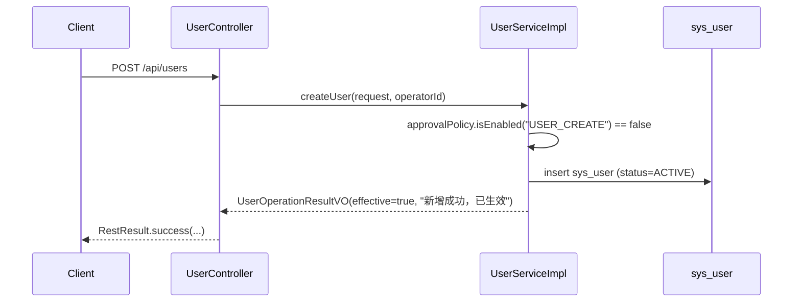
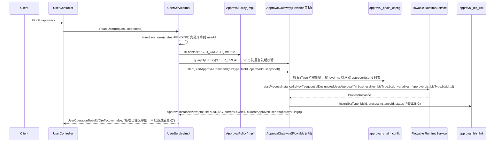
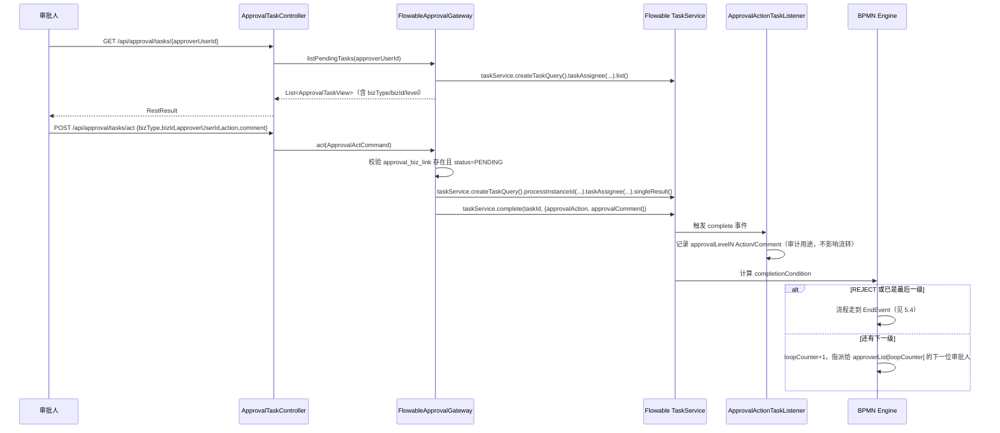
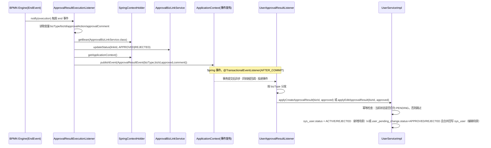
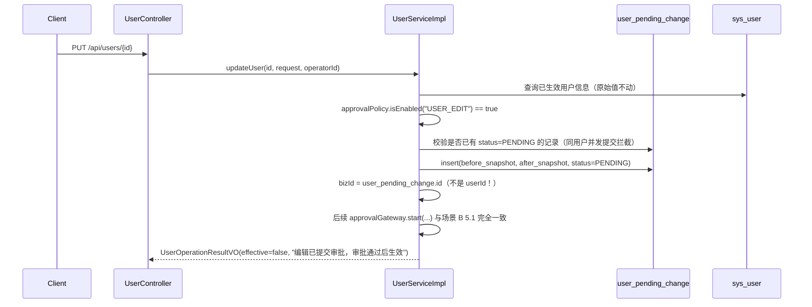

# 用户管理审批流程 —— 代码执行流程梳理

> 本文档梳理 `user-management-approval` 变更中"审批"能力的完整代码执行路径，覆盖开关关闭/开启两种场景、新增/编辑两个业务动作、Flowable 引擎内部机制、以及审批结果回写业务状态的全过程。所有类名、方法名、路径均对应 `backend/` 下的实际实现，非设计草稿。

## 1. 涉及的包与职责边界

```
identity/                              业务层，禁止 import org.flowable.*
  controller/UserController            新增/编辑/列表/详情 HTTP 接口
  service/impl/UserServiceImpl         业务编排：是否需要审批、落库、发起审批
  listener/UserApprovalResultListener  消费审批结果事件，驱动状态流转

approval/                              审批能力，唯一允许出现 org.flowable.* 的地方是 engine/flowable
  api/                                 对外契约：identity 只依赖这一层
    ApprovalGateway / ApprovalPolicy   接口
    dto/                               StartApprovalCommand、ApprovalInstanceView、ApprovalActCommand、ApprovalTaskView
    event/ApprovalResultEvent          纯 POJO 领域事件
  config/                              审批链配置 + 全局开关（纯数据库读写）
    controller/ApprovalConfigController
    service/impl/{ApprovalConfigServiceImpl, ApprovalPolicyImpl}
  link/                                业务单据 <-> processInstanceId 关联表
    service/ApprovalBizLinkService
  task/controller/ApprovalTaskController   审批人待办查询 / 同意驳回 REST 接口
  engine/flowable/                     唯一 import org.flowable.* 的包
    FlowableApprovalGateway            ApprovalGateway 的 Flowable 实现
    SpringContextHolder                 桥接：引擎反射创建的监听器借此拿到 Spring Bean/ApplicationContext
    listener/ApprovalActionTaskListener       任务 complete 事件：记录本级动作
    listener/ApprovalResultExecutionListener  流程 end 事件：发布领域事件
  resources/processes/sequential-designated-user-approval.bpmn20.xml   唯一一份流程定义
```

## 2. 涉及的数据库表

| 表 | 作用 | 关键字段 |
|---|---|---|
| `sys_user` | 用户主表 | `status`: `PENDING`/`ACTIVE`/`REJECTED`，不存任何 Flowable 相关列 |
| `user_pending_change` | 编辑场景的"待生效变更"快照 | `user_id`、`before_snapshot`/`after_snapshot`（JSON）、`status` |
| `approval_switch` | 全局总开关，固定单行 | `id=1`、`approval_enabled` |
| `approval_chain_config` | 按 `biz_type` 维护的审批链 | `(biz_type, level_no)` 唯一，`approver_user_id` |
| `approval_biz_link` | 业务单据 ↔ Flowable 流程实例的关联表 | `biz_type + biz_id` 查、`process_instance_id` 唯一、`status` |

`identity` 侧的表与 Flowable 运行时表（`ACT_*`）之间**没有任何外键或直接列关联**，全部通过 `approval_biz_link` 间接关联。

## 3. 核心契约（`approval.api`）

```java
interface ApprovalGateway {
    ApprovalInstanceView start(StartApprovalCommand command);
    ApprovalInstanceView queryByBizKey(String bizType, String bizId);
    void act(ApprovalActCommand command);
    List<ApprovalTaskView> listPendingTasks(String approverUserId);
}

interface ApprovalPolicy {
    boolean isEnabled(String bizType);   // 当前实现忽略 bizType，只读 approval_switch 单行总开关
}
```

`identity.UserServiceImpl` 只依赖这两个接口，编译期不知道背后是 Flowable。

## 4. 场景 A：全局开关关闭 —— 直接生效（不产生任何流程实例）



- 代码位置：`UserServiceImpl.createUser` 第 56-70 行、`updateUser` 第 90-98 行。
- **不会调用 `ApprovalGateway.start(...)`**，因此不会有任何 `runtimeService.startProcessInstanceByKey(...)` 调用，`approval_biz_link` 不产生新记录（已在任务组 8.1 端到端验证中实测确认）。
- 编辑场景（`updateUser`）在开关关闭时**直接覆盖** `sys_user` 的字段，不经过 `user_pending_change` 表。

## 5. 场景 B：全局开关开启 —— 新增用户走多级审批

### 5.1 发起阶段



- 代码位置：`UserServiceImpl.createUser` 第 72-79 行调用 `rejectIfAlreadyPending` + `approvalGateway.start(...)`；`FlowableApprovalGateway.start` 第 49-80 行。
- `bizId` = 新插入 `sys_user` 记录的自增主键（字符串形式）。
- `payloadSnapshot` 只是审计快照（`UserFieldsSnapshot` 序列化为 JSON），**不参与审批流转逻辑**。
- 若该 `bizType` 尚未配置审批链（`approval_chain_config` 无记录），`FlowableApprovalGateway.start` 直接抛 `BusinessException`，发起失败（对应 design.md 的风险兜底）。
- 事务边界：`UserServiceImpl.createUser` 标注 `@Transactional`，`sys_user` 插入与 `FlowableApprovalGateway.start` 内部的 `approval_biz_link` 写入、`runtimeService.startProcessInstanceByKey(...)` 共享同一个 Spring 事务（Flowable 复用应用主数据源），要么一起提交要么一起回滚。

### 5.2 BPMN 内部机制（`sequential-designated-user-approval.bpmn20.xml`）

```
StartEvent → UserTask[顺序多实例, isSequential=true] → EndEvent
```

- `flowable:assignee="${approverList[loopCounter]}"`：每一次循环把任务指派给 `approverList` 中对应下标的人。
- `loopCardinality = ${approverList.size()}`：循环次数 = 本次审批链的级数。
- `completionCondition = ${approvalAction == 'REJECT' || nrOfCompletedInstances == nrOfInstances}`：任一级驳回立即短路，不再创建后续级别任务；否则要等所有级别都走完。
- **同一份流程定义**支撑任意级数的审批链，改配置只改变传入的 `approverList` 长度，不需要新增/重新部署流程定义。
- `loopCounter` 是顺序多实例**子执行**上的局部变量：`ApprovalActionTaskListener`/`FlowableApprovalGateway.resolveLevel` 必须用非 Local 的 `getVariable`（从任务所在执行开始逐级查找）读取，`getVariableLocal` 读不到。

### 5.3 审批人操作阶段（逐级同意）



- 代码位置：`ApprovalTaskController` 第 32-45 行、`FlowableApprovalGateway.act`/`listPendingTasks` 第 103-145 行、`ApprovalActionTaskListener.notify` 第 20-34 行。
- `act` 找不到"该审批人在该流程实例下的待办任务"时（已被处理/审批人不对）会抛 `BusinessException`，接口返回失败，不会误操作。

### 5.4 流程结束 → 领域事件 → 业务状态回写



- 代码位置：`ApprovalResultExecutionListener.notify` 第 28-42 行；`UserApprovalResultListener.onApprovalResult` 第 24-32 行；`UserServiceImpl.applyCreateApprovalResult`/`applyEditApprovalResult` 第 168-206 行。
- **关键解耦点**：`ApprovalResultExecutionListener`（Flowable 引擎反射创建、非 Spring Bean）完全不知道 `identity` 模块的存在，只发布不依赖 `org.flowable.*` 的纯 POJO 事件；`UserApprovalResultListener`（普通 Spring `@Component`）被动订阅，两者之间没有直接调用。
- `SpringContextHolder.getBean(Class)` 用于拿一般 Bean（如 `ApprovalBizLinkService`）；`ApplicationEventPublisher` 由 `ApplicationContext` 直接实现、不是独立可查询的 Bean，因此改为 `SpringContextHolder.getApplicationContext()` 直接拿 `ApplicationContext` 发布事件。
- `@TransactionalEventListener(phase = AFTER_COMMIT)`：只有触发事件的 Flowable 事务（审批人完成最后一级任务）已提交后才会更新业务状态，避免读到未提交、可能回滚的中间态；这依赖业务库与 Flowable `ACT_*` 表共用同一个 `PlatformTransactionManager`（同一数据源）。
- 幂等：`applyCreateApprovalResult`/`applyEditApprovalResult` 处理前先判断当前状态是否仍为 `PENDING`，若不是（重复消费同一事件、或状态已被其他路径改变）直接跳过。

## 6. 场景 C：编辑用户走审批（与新增的关键差异）



- 编辑场景的 `bizId` 是新生成的 `user_pending_change.id`，**不是** `userId`；`sys_user` 表在审批通过前**完全不改动**，保证"驳回后原始信息不变"。
- 审批通过后（见 5.4 的 `applyEditApprovalResult`）：`user_pending_change.status = APPROVED`，并把 `after_snapshot` 中的字段合并写回 `sys_user`；驳回则只把 `user_pending_change.status = REJECTED`，`sys_user` 保持原值不变。
- 并发防护采用两层：
  1. `UserServiceImpl.updateUser` 在生成新 `user_pending_change` 记录前，先按 `userId` 查是否已存在 `PENDING` 记录（真正生效的"同一时刻只允许一条待审批变更"约束）。
  2. `rejectIfAlreadyPending` 用新生成的 `bizId` 再调一次 `queryByBizKey`（design.md D3 字面描述的防御性检查，针对同一 `bizId` 重复发起）。

## 7. 审批链配置 / 全局开关的读写路径（前置准备，不属于审批流转本身）

```
GET/PUT /api/approval/switch          → ApprovalConfigController → ApprovalConfigServiceImpl → approval_switch
GET/PUT /api/approval/chains/{bizType} → ApprovalConfigController → ApprovalConfigServiceImpl → approval_chain_config
```

- `saveChain` 会校验级别从 1 开始连续、审批人非空，校验通过后**整体替换**（先删后插）该 `bizType` 下的审批链。
- `ApprovalPolicyImpl.isEnabled(bizType)` 目前直接忽略 `bizType` 参数，只读 `approval_switch` 单行总开关。

## 8. 关键类速查表

| 类 | 包 | 一句话职责 |
|---|---|---|
| `UserController` | `identity.controller` | 用户增/改/查 HTTP 入口 |
| `UserServiceImpl` | `identity.service.impl` | 是否需要审批的业务编排、落库、发起审批、应用审批结果 |
| `UserApprovalResultListener` | `identity.listener` | 订阅 `ApprovalResultEvent`，驱动用户状态流转，AFTER_COMMIT + 幂等 |
| `ApprovalGateway` / `ApprovalPolicy` | `approval.api` | 业务层依赖的唯一防腐层契约 |
| `ApprovalResultEvent` | `approval.api.event` | 纯 POJO 领域事件，不依赖 Flowable |
| `ApprovalConfigController` | `approval.config.controller` | 全局开关、审批链配置的增删改查接口 |
| `ApprovalTaskController` | `approval.task.controller` | 审批人待办查询、同意/驳回接口 |
| `ApprovalBizLinkService` | `approval.link.service` | 业务单据 ↔ `processInstanceId` 关联表读写 |
| `FlowableApprovalGateway` | `approval.engine.flowable` | `ApprovalGateway` 的 Flowable 实现，唯一直接调用 `RuntimeService`/`TaskService` 的地方 |
| `SpringContextHolder` | `approval.engine.flowable` | 桥接：引擎反射创建的监听器借此拿到 Spring Bean/`ApplicationContext` |
| `ApprovalActionTaskListener` | `approval.engine.flowable.listener` | 任务 `complete` 事件：记录本级审批动作（审计用），不发事件、不调业务代码 |
| `ApprovalResultExecutionListener` | `approval.engine.flowable.listener` | 流程 `end` 事件：更新 `approval_biz_link` 状态、发布 `ApprovalResultEvent` |
| `sequential-designated-user-approval.bpmn20.xml` | `resources/processes` | 唯一一份 BPMN：顺序多实例用户任务 + `completionCondition` 驳回短路 |

## 9. 两条完整链路小结

**新增（开关开启）：**
`POST /api/users` → `sys_user(PENDING)` 落库 → `ApprovalGateway.start` → 读审批链 → 启动流程实例 → `approval_biz_link(PENDING)` → 逐级 `POST /api/approval/tasks/act` 同意 → 流程 `end` → `ApprovalResultExecutionListener` 更新 `approval_biz_link` + 发布事件 → `UserApprovalResultListener` → `sys_user.status = ACTIVE`。

**编辑（开关开启，首级驳回）：**
`PUT /api/users/{id}` → 校验无并发中的变更 → `user_pending_change(PENDING)` 落库（`sys_user` 不动）→ `ApprovalGateway.start` → 第一级审批人 `POST /api/approval/tasks/act {action:REJECT}` → `completionCondition` 短路，不产生第二级任务 → 流程 `end` → `approval_biz_link(REJECTED)` + 事件 → `UserApprovalResultListener` → `user_pending_change.status = REJECTED`，`sys_user` 保持原值不变。

以上两条链路均已在任务组 8 的端到端验证中，使用真实本地 MySQL + Redis 启动后端服务实测通过（细节见 `tasks.md` 8.1-8.3）。
